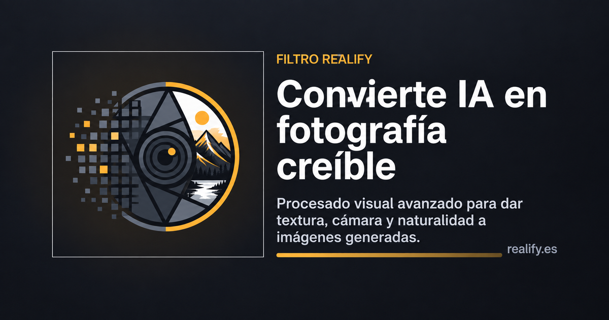

<div align="center">

<a href="https://realify.es">
  
</a>

# Realify

**Editor de imágenes profesional que funciona en el navegador. Sin instalación, sin cuenta y sin subir tus fotos a ningún servidor.**

[](https://realify.es)
[](LICENSE)
[](https://realify.es)


### [🚀 Abrir Realify en realify.es](https://realify.es)

[Características](#características-destacadas) ·
[Funcionalidades](#índice) ·
[Tecnología](#16-tecnología) ·
[Desarrollo local](#15-despliegue) ·
[Contribuir](CONTRIBUTING.md) ·
[Novedades](CHANGELOG.md)

</div>

---

## Qué es Realify

Realify es un editor de imágenes completo que funciona en el navegador. Todo el
procesado —capas, filtros, revelado RAW, modelos de IA— ocurre en el equipo del
usuario: **las imágenes no se suben a ningún servidor**. Se instala como app
(PWA) y funciona sin conexión.

La versión pública está en **[realify.es](https://realify.es)**.

## Características destacadas

<table>
<tr>
<td width="50%" valign="top">

### 🎨 Edición por capas
Capas, grupos, máscaras, modos de fusión, estilos de capa, objetos
inteligentes y capas de ajuste y de filtro reeditables.

</td>
<td width="50%" valign="top">

### 📷 Revelado RAW de 16 bits
Más de 40 formatos RAW con LibRaw en WebAssembly, flujo lineal de 16 bits y
vista previa por GPU. Modo **Premium 👑**: Rec.2020, demosaico DHT, flujo de
escena en coma flotante, tono local sin halos y exportación TIFF de 16 bits.

</td>
</tr>
<tr>
<td valign="top">

### 🤖 IA local
Seleccionar sujeto y cielo, eliminar fondo, rellenar y expandir según el
contenido, ampliar ×2/×4, colorear fotos en blanco y negro y reducir ruido,
sin enviar la imagen a nadie.

</td>
<td valign="top">

### ⚡ Aceleración por GPU
Filtros en WebGL2 y WebGPU, con alternativa en CPU y Web Workers para que
nunca falle un resultado.

</td>
</tr>
<tr>
<td valign="top">

### ✨ Creatividad
Fusión HDR de hasta 11 fotos, panorámicas, 160 estilos, 215 estilos vintage, 119 marcos,
LUT `.cube`, recortes en ~60 formas, memes, stickers, collages y publicaciones
para más de 29 formatos de redes sociales.

</td>
<td valign="top">

### 📱 Escritorio y móvil
Menús clásicos en escritorio; en móvil, un cajón de herramientas pensado para
el pulgar. Instalable y disponible sin conexión.

</td>
</tr>
</table>

### Principios

- **Sin instalación ni cuenta**: basta con abrir [realify.es](https://realify.es).
- **Privado por diseño**: el procesado es local; los modelos de IA se
  descargan, las imágenes nunca se suben.
- **Escritorio y móvil**: menús clásicos en escritorio; en móvil, barra
  inferior y un cajón de herramientas ordenado por objetivo (básicos,
  automáticos, mejorar, corregir, color, estilo…) con buscador tolerante a tildes y erratas. Los
  editores grandes se abren a pantalla completa, con la imagen primero y
  mandos pensados para el pulgar.
- **Sin dependencias ni compilación**: HTML, CSS y JavaScript con módulos ES.

---

## Índice

1. [Archivos: abrir, guardar y exportar](#1-archivos-abrir-guardar-y-exportar)
2. [Edición e historial](#2-edición-e-historial)
3. [Herramientas](#3-herramientas)
4. [Imagen](#4-imagen)
5. [Selección y máscaras](#5-selección-y-máscaras)
6. [Capas](#6-capas)
7. [Texto](#7-texto)
8. [Ajustes de color y tono](#8-ajustes-de-color-y-tono)
9. [Filtros](#9-filtros)
10. [Módulos especiales](#10-módulos-especiales)
11. [Análisis y metadatos](#11-análisis-y-metadatos)
12. [Vista](#12-vista)
13. [App, privacidad y ayuda](#13-app-privacidad-y-ayuda)
14. [Estructura del proyecto](#14-estructura-del-proyecto)
15. [Despliegue](#15-despliegue)
16. [Tecnología](#16-tecnología)
17. [Compatibilidad](#17-compatibilidad)
18. [Contribuir](#18-contribuir)
19. [Licencias](#19-licencias)

---

## 1. Archivos: abrir, guardar y exportar

| Función | Qué hace |
|---|---|
| **Abrir imagen** | Diez familias explícitas: JPEG, PNG, WebP, BMP, SVG, TIFF, HEIC, HEIF, JPEG XL, PSD y PSB (con capas, máscaras y efectos). PNG y TIFF de 16 bits, AVIF de 10/12 bits y el RAW revelado con Premium conservan sus bits en la capa base para la exportación en coma flotante (`js/core/hisrc.js`, `js/io/hidepth.js`). Las fotos con colores de gama amplia (Display P3) se detectan y el documento trabaja en P3 si el navegador lo permite. Se reconocen además 40 extensiones RAW que se envían al revelador; otros `image/*` dependen del navegador. También se puede arrastrar y soltar o pegar desde el portapapeles. |
| **Cargar archivos en pila** | Abre varias imágenes como capas de un mismo documento. |
| **Documento nuevo** | Lienzo vacío del tamaño elegido. |
| **Collage / History / Post** | Composiciones para redes creadas como documento nuevo (ver [módulos especiales](#collage--history--post--socialmediapost)). |
| **Varios documentos** | Cada documento se abre en su propia pestaña. |
| **Abrir / Guardar proyecto** | Guarda el documento completo (capas, máscaras, capas de ajuste y de filtro, textos) para seguir editándolo más tarde. |
| **Exportar / Exportar como** | Sin capas: JPEG, PNG, WebP, AVIF, **AVIF de 10/12 bits**, **HEIC** (con el codificador HEVC del propio dispositivo vía WebCodecs y un empaquetador HEIF propio, `js/io/heic.js` y `js/io/heif.js`; sólo donde existe: Safari en Apple, Chrome/Edge con hardware), **JPEG XL**, **OpenEXR** (luz lineal, half, ZIP; escritor propio en `js/io/exr.js`), PDF, **TIFF RGBA sin pérdidas (8 bits por canal)** y **PNG / TIFF de 16 bits por canal**. **Alta precisión al exportar**: capas, capas de ajuste y modos de fusión recompuestos en coma flotante por franjas (sin bandas al apilar ajustes) y remuestreo en RGB lineal, hasta 32 MP en ordenador y 16 MP en móvil (`js/core/precision-stack.js`). **Color de gama amplia**: las fotos Display P3 se editan en P3 (`js/core/colorspace.js`) y se exportan con su perfil ICC incrustado en JPEG, PNG y PNG/TIFF de 16 bits (`js/core/icc.js`, `js/io/icc-embed.js`) y en AVIF/EXR con su etiqueta de color (`colr/nclx`, cromaticidades), o convertidas a sRGB a elección. Exportar como también genera **PSD / PSB** (`js/io/professional-formats.js`: capas, grupos, máscaras reales, efectos de capa, 27 modos de fusión, capas de ajuste Invertir/Niveles/Curvas, recorte, sRGB y 72 ppp; PSB hasta 300 000 px) y **PSD / PSB de 16 bits** de la imagen final (escritor propio `js/io/psd16.js`). Los ajustes, máscaras, textos y filtros nativos sólo siguen reeditables en el proyecto `.realify`; PSD guarda una vista compuesta exacta y una referencia oculta si hay ajustes. TIFF de 8 bits y PSD no incrustan un perfil ICC (se guardan en sRGB). Gestor de códecs WASM bajo demanda (`js/io/codecs.js`, JPEG XL y AVIF de jSquash, Apache-2.0) con **peso y calidad estimados** (PSNR) antes de exportar. Calidad, escalas y estimación de peso donde procede; perfiles para web e impresión y tramado opcional. |
| **Exportar PNG rápido** | Descarga inmediata en PNG. |
| **Prueba para redes sociales** | Muestra cómo quedará la imagen tras la recompresión típica de las redes. |
| **Exportar GIF animado** | Cada capa visible es un fotograma (sola o acumulada): duración, bucle, ida y vuelta, tamaño y número de colores. |
| **Exportar PDF** | PDF profesional con pdf-lib (`js/io/pdfpro.js`, `js/io/pdfexport.js`): varias páginas, A5/A4/A3/Carta/Legal o tamaño de la imagen, márgenes, sangrado (TrimBox/BleedBox), 1–9 imágenes por página, portada, numeración, metadatos y resolución objetivo; los JPEG que ya caben se incrustan sin recomprimir. |
| **Hoja de contactos** | Pantalla completa: hasta 200 fotos en páginas A4, A3, A5, Carta, Oficio o 10 × 15 con columnas, márgenes, título y nombre de cada foto. PDF de varias páginas o capas (`hojacontactos/`). |
| **Editar en lote / Aplicar esta edición a otras fotos** | Edita una foto y copia su edición (capas de ajuste, filtros, textos, marcas de agua) a otras pestañas o fotos de la galería, con vista previa e **igualado de exposición**. Resultado en sus pestañas, con capas reeditables, o en un ZIP (`lote/`). |
| **Acciones** | Graba una secuencia de ajustes, filtros y comandos con los valores de sus diálogos y repítela en la foto abierta o en lote (ZIP en JPEG, PNG, WebP o AVIF). Se exportan e importan en JSON. |
| **Restaurar al estado original** | Descarta capas, ediciones e historial y vuelve al archivo tal como se abrió. |

Formatos RAW admitidos (vía LibRaw): `3fr ari arw bay cap cr2 cr3 crw dcr dcs
dng drf eip erf fff gpr iiq k25 kdc mdc mef mos mrw nef nrw obm orf pef ptx pxn
r3d raf raw rwl rw2 rwz sr2 srf srw x3f`.

## 2. Edición e historial

- Deshacer y rehacer ilimitados, con niveles de historial configurables.
- Copiar, cortar, pegar y borrar la selección.
- **Instantáneas**: copias completas y con nombre del documento («antes del
  retoque») para volver a ellas sin deshacer paso a paso.
- **Pincel de historial**: pinta sobre la capa activa píxeles de una
  instantánea.

## 3. Herramientas

| Herramienta | Atajo | | Herramienta | Atajo |
|---|---|---|---|---|
| Mover | V | | Clonar | S |
| Mano | H | | Eliminar manchas | J |
| Zoom | Z | | Mover según el contenido | — |
| Recortar | C | | Exponer (sobre/subexponer) | O |
| Pincel | B | | Dodge & Burn (gris 50 %) | Ctrl+Mayús+D |
| Borrador | E | | Emborronar | R |
| Bote de pintura | G | | Licuar | Q |
| Degradado | N | | Transformación libre | F |
| Formas | U | | Perspectiva | P |
| Texto | T | | Pincel de historial | Ctrl+Mayús+H |
| Selección rectangular | M | | Pluma (trazados) | A |
| Selección elíptica | K | | Cuentagotas | I |
| Lazo | L | | Comparar antes/después | Y |
| Varita mágica | W | | | |

Los pinceles tienen tamaño, dureza, opacidad, flujo, espaciado y dispersión.
Mover ajusta a los bordes y centros de las demás capas.
Como en Photoshop, **Alt + botón derecho y arrastrar** cambia el tamaño (horizontal) y la dureza (vertical) de pinceles y herramientas de retoque compatibles.

**Dinámicas del pincel**: la presión, velocidad e inclinación del stylus (o
emuladas con el ratón) pueden aplicarse a:
- Tamaño del pincel
- Opacidad
- Flujo
- Dispersión

Biblioteca de puntas: estándar, desde imagen, desde capa o archivos `.abr`.

**Pinceles especiales** (barra del Pincel o **Editar › Pinceles especiales**):

- **Simétrico**: eje vertical, horizontal, ambos, cualquiera de las dos
  diagonales (la diagonal real del documento), las dos a la vez o radial de 2 a
  16 radios, con los ejes visibles como guía.
- **Con textura**: grano, papel, lienzo, cristales, rayones, esponja o ruido
  fino, generados de forma procedural y fijos al documento, con relieve y
  escala.
- **De degradado**: el color recorre del frontal al de fondo (o el arcoíris) a
  lo largo del trazo, con longitud y repetición configurables.

**Dodge & Burn** con «Ver gris 50 %»: muestra la capa gris de retoque en
tiempo real mientras se pinta.

## 4. Imagen

- Tamaño de imagen con remuestreo **Lanczos 3, Mitchell, Catmull-Rom**,
  bilineal o del navegador (en segundo plano) y tamaño de lienzo.
- **Escala según el contenido**: redimensiona la imagen sin distorsionar objetos
  importantes. Analiza bordes y detalle, da más espacio a columnas con bordes y
  protege al sujeto. No destructivo: las capas se adaptan de forma inteligente.
  Las máscaras de capa se reescalan, giran y recortan con la imagen.
- Recortar y **corregir perspectiva**.
- Girar 90°/180° y voltear en horizontal o vertical.
- **Fusión HDR** (pantalla completa, `hdr/`): de 1 a 11 fotos con el
  horquillado detectado por EXIF o por el brillo, alineación, antifantasmas,
  mapa de radiancia o fusión de exposición y mapeo tonal (detalles realzados,
  compresor de tonos, fotográfico) con 17 estilos en miniatura. Se abre como foto nueva.
  Modo **Premium 👑**: curva de respuesta de la cámara estimada (Robertson), RAW en
  luz lineal, fusión de máxima verosimilitud, alineación subpíxel (Lucas–Kanade),
  antifantasmas por zonas, color en OKLab, TIFF de 16 bits y radiancia `.hdr`.
- **Unir imágenes** (pantalla completa, `unir/`): panorámica automática
  (proyección cilíndrica, solape por correlación de gradientes, exposición
  igualada, costuras suaves y recorte) o unión en fila, columna o cuadrícula.
- **Apilar fotos Premium 👑** (`js/features/stack.js`, `js/cv/`): de 2 a 16 tomas de la
  misma escena, alineadas con precisión subpíxel con OpenCV.js (puntos ORB + RANSAC +
  afinado ECC, flujo óptico opcional; OpenCV 4.12, Apache-2.0, 11 MB, sólo al usarlo) y
  combinadas por franjas en luz lineal: reducir ruido con rechazo de movimiento (el ruido
  baja en √N) o ampliar el enfoque (la toma más nítida en cada punto). Foto nueva a
  resolución completa.
- **Corrección de lente por perfil Premium 👑** (`js/features/lenscorrect.js`, `js/lens/`): EXIF →
  objetivo de la base de Lensfun (`assets/lensdb/lensfun.json`, CC BY-SA 3.0, construida con
  `tools/build-lensdb.mjs`) → distorsión (poly3, poly5, ptlens), aberración cromática (lineal,
  poly3) y viñeteo (pa) a resolución completa, un solo remuestreo bicúbico. Fórmulas
  reimplementadas y comprobadas contra Lensfun (menos de 1 px).
- **Seleccionar por texto Premium 👑** (`js/features/textselect.js`, `js/ai/textclasses.js`): una frase
  («coche rojo», «césped sin personas») → selección o máscara de capa. Usa el DeepLab ADE20K que ya
  viaja con la web (150 categorías, vocabulario y sinónimos en español, colores por HSV), por
  bloques y con borde ajustado por filtro guiado; sin descargas; lo que no esté en esas categorías se busca con **CLIPSeg** (descripción libre; modelo fp16 de 273 MB que se baja una vez de Hugging Face; tokenizador CLIP propio `js/ai/cliptokenizer.js`, diccionario ES→EN `js/ai/es2en.js`). Además entiende **pelo, cara, ojos, labios, orejas, cuello, gafas y sombrero** con BiSeNet (`faceparsing`, uso no comercial; se descarga una vez). Vocabulario cerrado.
- **Ajustes en coma flotante** (`js/editor/floatadjust.js`, opción `float` de `runAdjust`): los ajustes
  de color puro (Brillo y contraste, Niveles, Curvas, Balance de blancos, Tono y saturación, Exposición, Color por
  canales, Mezclador, Vibrance) calculan en coma flotante desde el origen de 16 bits de la capa y la capa de
  filtro conserva sus 16 bits (el lienzo de 8 bits es su redondeo tramado). Sin origen de 16 bits, todo
  sigue como siempre.
- **Filtros en coma flotante** (`js/editor/floatfilter.js`, opción `float` de `runFilter` y del diálogo en vivo
  de `photo-tools`): los filtros locales (desenfoques, enfoques, ruido, Detalle y estructura, Viñeteado,
  Reducción de ruido, Enfoque selectivo, Retoque de retrato, PurePixel…) suman su cambio a los 16 bits del origen
  («delta»), y los Estilos y las Tablas de color calculan en coma flotante a través de una rejilla RGB
  («color»). Los filtros que mueven o sustituyen la imagen siguen en 8 bits.
- **Vista previa en coma flotante en GPU** (`js/gpu/floatcompositor.js`, fase 13): el mismo árbol de capas
  que el compositor de 8 bits se recompone en WebGL2 con texturas RGBA32F/RGBA16F —opacidad, 28 modos de
  fusión, máscaras, recorte, grupos, Fusionar si y capas de ajuste (rejilla RGB de 86³ o curvas de 4096
  puntos)— con las fórmulas de `core/precision-stack.js`, que es la referencia en las pruebas (diferencia
  máxima 0,03 niveles en 32 bits y 0,4 en 16 bits). Las capas con origen de 16 bits muestran esos bits (misma
  regla de `core/hisrc.js`, comprobada en la GPU) y el paso a 8 bits lleva el tramado de la exportación.
  Sólo se usa si compensa (ajustes, 16 bits, Fusionar si o modos «a mano») y todo está soportado; con estilos
  de capa, trazo en curso o un documento muy grande, sigue el camino de 8 bits. Documentos Display P3 también
  (se comprueba una vez que el navegador conserva el P3 por la GPU).
- **Exportación en coma flotante con estilos de capa y Fusionar si** (`core/precision-stack.js`): la sombra,
  el resplandor y el trazo se dibujan aparte (láminas de 8 bits de colores sólidos), la capa va encima en
  coma flotante y el degradado y Fusionar si se evalúan sin redondear; ya no se parte del aplanado de 8 bits.
- **Los 16 bits sobreviven al documento** (`js/core/hisrc.js`, fase 14): girar, voltear, recortar y ampliar el lienzo
  mueven el origen de 16 bits con el lienzo (y lo vuelven a tramar en su sitio), con deshacer y rehacer sin copias en
  el historial; los proyectos `.realify` y el guardado antes de actualizar lo guardan como PNG de 16 bits; duplicar
  capa lo conserva. Exportar tras girar y recortar da los mismos 16 bits que la foto original, bit a bit.
- **Metadatos y privacidad** (`js/exif/inspector.js`, `js/io/metadata.js`, fase 15): el inspector enseña todo lo que lleva el
  archivo original (EXIF, GPS, IPTC, XMP, ICC, MPF, Photoshop, notas del fabricante, miniatura) con un resumen de datos
  personales, leído con ExifReader (MPL-2.0, sin modificar). Al exportar JPEG, PNG o WebP se pueden volver a escribir, desde el
  original y por lista blanca, autor y copyright, fecha, cámara, GPS y descripción (nunca la miniatura, las notas del fabricante ni
  la orientación). «Limpiar metadatos» puede quitar sólo la ubicación y los números de serie sin recomprimir.
- **Análisis de nitidez** (`js/features/sharpness.js`): mapa de enfoque a resolución completa en
  una capa nueva y ranking de tomas con nota 0-100 (varianza del Laplaciano en los bloques más
  nítidos, a 1024 px).
- **Escanear documento Premium 👑** (`js/features/docscan.js`, `js/cv/docquad.js`): cuadrilátero
  con OpenCV (Canny y Otsu), esquinas editables, proporción real por el método de Zhang y He y
  homografía Lanczos a resolución completa.
- **Perspectiva automática** (botón «Automático 👑» de Perspectiva, `js/cv/lines.js`): Hough
  probabilista + RANSAC de punto de fuga para poner las guías solas.
- **Contraste local (CLAHE)** (`js/editor/clahe.js`, `clahe-math.js`): normal y Premium (OKLab,
  1024 niveles, croma que acompaña a la luz, tramado).
- **Cortar en partes** (pantalla completa, `cortar/`): cuadrícula, tamaño fijo,
  carrusel, perfil de Instagram (orden de subida) o cortes a mano. Cada trozo en
  una capa nueva, en su pestaña, en un ZIP o suelto.
- **Recortar en forma** (pantalla completa, `formas/`): unas 60 formas
  (polígonos de 3 a 24 lados, estrellas de 3 a 30 puntas, corazón, flores,
  nube, bocadillos, engranaje, anillo, marco, flechas, puzle…) que se mueven,
  escalan y giran sobre la foto, con borde suave y contorno. Capa nueva con
  transparencia.
- **Antes y después** (pantalla completa, `comparar/`): imagen de comparación
  dividida, diagonal, lado a lado o apilada, con etiquetas y formatos de redes.
- **Selección con un toque 👑** y **Borrador mágico 👑** (Premium, menú
  Inteligencia Artificial): tocas un objeto y la IA (Segment Anything:
  MobileSAM + decodificador de SAM) lo selecciona entero, con borde afinado a
  la resolución de la foto; el borrador lo quita y LaMa rellena el hueco en una
  capa nueva, con costura en luz lineal y el grano de la foto.
- **Enderezar automáticamente** (Imagen): busca todas las líneas rectas de la
  foto, propone el ángulo y deja afinarlo con vista previa antes de aplicar.
- **Recorte inteligente para redes 👑** (Premium, Inteligencia Artificial ›
  Encuadre): el mejor encuadre para cada formato de red social según el sujeto
  y las caras, sin cortar cabezas.
- **Caras 👑** (Premium, Inteligencia Artificial › Caras, con YuNet incluido):
  **Difuminar caras** (desenfoque irreversible, pixelado o relleno, cara a
  cara), **Retoque de cara** (piel, ojos, dientes y labios por separado, con
  BiSeNet), **Restaurar caras** (GFPGAN: reconstruye caras borrosas, antiguas
  o comprimidas conservando el color de piel y el grano), **Ojos rojos** automático y **Recorte de retrato** (Recortar con el
  marco ya encuadrado en la cara).
- **Iluminar con IA 👑** (Premium, Inteligencia Artificial › Mejorar y
  restaurar): Zero-DCE++ estima una curva de luz por zona y color para fotos
  oscuras, con mapas ajustados a los bordes y limpieza del ruido de las sombras.
- **Profundidad 👑** (Premium, Inteligencia Artificial › Profundidad, con Depth
  Anything V2 Small, Apache 2.0, 50 MB que se descargan al usarlo):
  **Desenfoque por profundidad** (toca dónde enfocar; por capas de distancia,
  sin halos y con bokeh en las luces), **Niebla por distancia**, **Foto 3D**
  (animación con paralaje guardada como GIF), **Seleccionar por profundidad**
  (primer plano, plano medio, fondo o intervalo; como selección o como máscara de
  cualquier capa, también de ajuste), **Luz por profundidad** y **Separar planos**
  (una capa por plano con su máscara acumulativa).
- **Eliminar fondo** con IA local (U²-Net rápido, MODNet para retratos, ISNet
  de máxima calidad) o por color de los bordes: el recorte va a una capa nueva
  y la original se oculta.
- **Ampliar con IA** ×2 o ×4 (Real-ESRGAN, SPAN, UltraSharp), **Colorear con
  IA** (SpongeColor, Colorizer, DDColor; el color se aplica a la luminancia
  original) y **Expandir con IA** (LaMa rellena los bordes nuevos del lienzo).
- **Reemplazar cielo**: detecta el cielo (DeepLab/ADE20K) y lo sustituye por
  un cielo de la **biblioteca** (101 cielos: 82 fotografías CC0 de Poly Haven y
  19 cielos generados; búsqueda y filtros por hora y tiempo), una foto propia,
  un degradado o un color, en una capa con
  su máscara ajustada a los bordes de la foto (sin halo). El horizonte del
  cielo nuevo se coloca sobre el detectado; «Posición» lo sube o lo baja.

## 5. Selección y máscaras

**Selección**
- Todo, ninguna e invertir.
- **Seleccionar sujeto** (IA, BodyPix) y **seleccionar cielo** (IA).
- Pluma: trazados que se convierten en selección o en máscara de capa.
- Difuminar y **refinar borde** (pelo y bordes finos).
- **Rellenar según el contenido** (PatchMatch o LaMa con IA) y **mover según
  el contenido**.
- **Máscaras de luminosidad y color**.

**Máscaras de capa**
- Descubrir u ocultar todo o la selección, degradado lineal o radial y pintar
  la máscara.
- Invertir, activar/desactivar, niveles, curvas, suavizado y propiedades
  (densidad y difuminado).
- Aplicar o eliminar la máscara.

## 6. Capas

- Nueva, duplicar, eliminar, subir y bajar.
- **Grupos** (Ctrl+G / Ctrl+Mayús+G).
- **Modos de fusión**, opacidad y **Fusionar si** (blend-if por luminosidad).
- **Estilos de capa**: sombra, contorno, resplandor, bisel, superposición…
- **Objetos inteligentes**: transformaciones y filtros sin perder calidad;
  rasterizar cuando haga falta.
- **Capas de ajuste** (reeditables) y **capas de filtro** (el filtro se guarda
  en la capa y se puede reabrir).
- **Capas de relleno**: color sólido, degradado y motivo.
- **Alinear y distribuir** capas.
- Combinar con la de abajo, combinar visibles y acoplar imagen.
- Renombrar con doble clic en el nombre o desde el menú contextual; selección múltiple con Ctrl/Cmd o Mayús en escritorio y con el botón de selección en móvil. Las capas marcadas se pueden agrupar.
- **Añadir stickers** y **añadir marca de agua**.

## 7. Texto

- Capas de texto editables: fuente (del sistema y **las ~1900 tipografías libres
  del catálogo de Google Fonts**, alojadas en `/fonts/`, con buscador), tamaño, color,
  interlineado, espaciado, kerning, ligaduras, mayúsculas y versalitas.
- Estilos de carácter y de párrafo, alineación y sangrías.
- Cuadros de texto y **texto en trazado**.
- Rasterizar texto.

## 8. Ajustes de color y tono

Todos se pueden aplicar directamente o como capa de ajuste.

**Básicos**: brillo y contraste, exposición, niveles, curvas, sombras e
iluminaciones, balance de blancos, tonos (blancos/luces/sombras/negros), tono y
saturación, vibrance.

**Curvas**: RGB, rojo, verde, azul y **luminosidad** (cambia el brillo sin
tocar el color). Todas las curvas se ven a la vez y hay una vista R · G · B
en tres paneles simultáneos. Las curvas de luminosidad y color se pueden
**vincular** y repartir su efecto. Incluye **25 estilos** con miniatura (S
clásica, cine, mate, proceso cruzado, clave alta…) y estilos propios guardados
en el navegador.

**Tonos del histograma**: ajusta solo una franja de tonos (negros, sombras,
medios, luces o blancos) eligiéndola en el histograma; brillo, contraste,
saturación y calidez con bordes suaves.

**Color avanzado**: gradación de color, virado dividido, filtro fotográfico,
**tono y saturación por rangos** (mezclador HSL de ocho rangos con cuentagotas;
no afecta a grises), reemplazar color, igualar color, curvas Lab y de
luminosidad, color por canales, equilibrio de color, corrección selectiva,
mezclador de canales y mapa de degradado.

**Automáticos** (primer submenú de Ajustes): mejora automática, tono/color,
contraste y niveles automáticos e **Iluminar foto oscura** (abre las sombras
según la luz de cada zona, tipo LIME/Retinex), cada uno con su versión Premium 👑. Antes de
corregir diagnostican la foto (dominante de color con confianza, luces ya
quemadas, brillos aislados, exposición fuera de rango, colores extremos
neutros) y respetan lo que es intencionado: la luz cálida, una escena de un
solo color, un fondo blanco o una foto nocturna.

**Tono avanzado**: quitar neblina, tono HDR, contraste tonal y densidad neutra
graduada o radial.

**Mapa tonal**: umbral, posterizar, ecualizar, desaturar, blanco y negro (con
recetas) e invertir.

## 9. Filtros

| Grupo | Filtros |
|---|---|
| **Desenfoques** | Gaussiano, galería de desenfoque, caja/forma/promedio/inteligente, movimiento, lente, radial/zoom y superficie. |
| **Enfoque y restauración** | Enfocar, máscara de enfoque/estabilizador (luminancia en coma flotante; deconvolución de foco Van Cittert y de movimiento Landweber, en workers por franjas), enfoque selectivo, nitidez inteligente, paso alto y mediana/polvo/destramar. |
| **Fotografía y detalle** | Corrección de lente, retoque de retrato, **separación de frecuencias**, Dodge & Burn, detalle y estructura, viñeteado. |
| **Ruido** | **Reducción de ruido con IA** (denoise, detección automática de nivel), reducción normal, por canal, **quitar artefactos JPEG con IA** y añadir ruido. |
| **Pixelizar** | Mosaico, cristalizar, puntillismo y semitono. |
| **Estilizar** | Relieve, hallar bordes, resplandor, solarizar, viento y óleo. |
| **Artísticos** | Galería de filtros artísticos. |
| **Interpretar** | Nubes, fibras, destello e iluminación. |
| **Textura** | Texturizador, grano, azulejos, craquelado, desplazamiento, mínimo y máximo. |
| **Distorsión y geometría** | Esferizar, coordenadas polares, distorsiones clásicas, gran angular adaptable, deformación de posición libre, perspectiva y **licuar**. |
| **Corrección local** | Pincel corrector, parche y tampón de clonar. |
| **Otros** | Convolución personalizada 5×5. |

Los filtros se procesan en GPU (WebGL2 y, si está disponible, WebGPU), con
alternativa en CPU y Web Workers: si la GPU da un error, el filtro se calcula
en CPU en lugar de devolver una imagen vacía. Todos dejan su resultado en una
capa de filtro reeditable.

## 10. Módulos especiales

Se abren desde **Filtro › Especiales** (y en móvil desde el cajón de
herramientas); Realify, PurePixel, Unmark y Adaptive Photo Lens, desde el menú
**Inteligencia Artificial** (pestaña del mismo nombre en el cajón). Cada uno es un editor a pantalla completa con vista previa.

### Revelado fotográfico (RAW) — `raw/`
Revelador RAW local basado en LibRaw (WebAssembly). Trabaja en RGB lineal de
16 bits con vista previa por GPU. Exposición, contraste, altas luces, sombras,
blancos, negros, temperatura, tinte, balance automático, vibrance, saturación,
enfoque, textura, claridad, reducción de ruido de luminosidad y de color, y
corrección de aberración cromática. También se puede usar sobre cualquier capa
raster. El interruptor **Premium** (corona) cambia a un motor de alta calidad
—Rec.2020, demosaico DHT, luz lineal en coma flotante, filtros guiados sin halos,
curva fílmica, color en OKLab, TIFF de 16 bits— con la misma matemática en GPU
(vista previa) y CPU (resultado). Detalles en [`raw/README.md`](raw/README.md).

### Realify — `js/filters/camera/`
Simulación de cámara en 31 etapas (óptica, sensor, procesador, archivo y
metadatos) con presets, recomendaciones según la imagen y ajuste a partir de los
datos EXIF. Editor a pantalla completa con zoom real hasta 1:1, comparación,
histograma y espectro. Interruptor **Premium 👑** (y entrada «Realify Premium 👑»):
los mismos mandos con la cadena en coma flotante de 32 bits, luces con hombro que
conserva el tono, tinte y saturación en OKLab con mapeo de gama y tramado a 8 bits.

### Marcos — `frames/`
**138 modelos en 12 categorías**, con un marco Liso de color único y 16 diseños
de autor: kintsugi, vitral, origami, constelación, holográfico y otros. Diamond y
Heart utilizan motivos vectoriales en los cuatro lados. Anchura y colores
editables en todos los modelos, tanto en móvil como en escritorio. La vista
previa y los mandos se adaptan al área visible del navegador. Zoom con rueda o
pellizco, arrastre para recorrer la imagen y «Encajar» para verla completa. El marco amplía el
lienzo, conserva la fotografía y se añade en una capa independiente; deshacer
recupera el tamaño anterior. Detalles en [`frames/README.md`](frames/README.md).

### Filtro Vintage — `vintagefilter/`
42 parámetros en 7 grupos (virados, color —con blanco y negro ortocromático y
pancromático—, tono, luz y película, daños, bordes y óptica), **215 estilos** en
19 categorías (décadas, cine clásico, laboratorio, retratos antiguos,
instantáneas, álbum de familia, noir, pop, tecnología retro, galería y museo…) y
un desplegable de **119 marcos** en 10 categorías con miniatura sobre la propia
foto (hoja desde abajo en el móvil). Semilla reproducible y capa de filtro
reeditable. Detalles en [`vintagefilter/README.md`](vintagefilter/README.md).

### Estilos y LUT
- **Estilos**: **160 looks** en 16 categorías (básicos, retrato, paisaje, cine,
  películas, urbano, comida, moda y editorial, redes sociales, blanco y negro,
  noche, estaciones, suaves y pastel, dramáticos, duotonos y creativos,
  vintage), con buscador, miniatura sobre la propia foto e intensidad
  regulable. Curvas por canal, saturación, virado partido y duotonos reales.
- **Tabla de color (LUT)**: carga archivos `.cube` y los aplica en una capa.

### Adaptive Photo Lens — `js/filters/lens/`
Un modelo local clasifica la foto entre 92 tipos (retrato, paisaje, comida,
noche…) y propone un revelado adecuado, con intensidad y siete ajustes
editables. El resultado va a una capa reeditable.

### PurePixel — `js/filters/purepixel/`
Procesado de píxeles y exportación en PNG sin metadatos.

### Unmark — `js/filters/unmark/`
Detección y relleno de marcas de agua. Admite un servidor propio opcional
(`server/unmark/`); sin él, todo se hace en local.

### Crear meme — `memes/`
26 diseños (clásico, desmotivador, comparación, cómic, póster, periódico,
historia 9:16…), segunda foto en los diseños que la admiten, marco, 11 efectos
de imagen y textos ilimitados con 29 tipografías y 26 estilos rápidos (neón,
3D, glitch, fuego…). Detalles en [`memes/README.md`](memes/README.md).

### Collage / History / Post — `socialmediapost/`
También en **Archivo › Collage / History / Post…**, incluso sin documento
abierto.
- **Formatos**: 29 de redes sociales (Instagram, TikTok, Facebook, X, Threads,
  LinkedIn, YouTube, Pinterest, WhatsApp…), 15 proporciones, 27 pantallas de
  móviles y tamaño personalizado.
- **Zonas seguras** de historias y de pantallas de móvil.
- **40 diseños de collage** de 1 a 16 fotos, con espaciado, márgenes,
  esquinas, marcos, sombras y fondo (color, degradado, foto difuminada o
  transparente).
- **Diseño «Libre»**: cada foto se coloca donde se quiera y se escala, gira,
  duplica y ordena con tirador, dos dedos o el panel.
- **28 formas** para las fotos (círculo, elipse, polígonos de 3 a 10 lados,
  estrellas de 4 a 10 puntas, corazón, flor, gota, escudo, cruz, luna, sello,
  nube, bocadillo…), para todas o por foto.
- Fotos desde archivo, portapapeles o arrastrando; bandeja con arrastrar a un
  hueco, encuadre, zoom e intercambio entre huecos.
- Textos con el mismo motor del creador de memes.
- El resultado se abre como documento nuevo, con cada foto y texto en su capa.

Detalles en [`socialmediapost/README.md`](socialmediapost/README.md).

### Stickers — `stickers/`
Desde **Capa › Añadir stickers…**. 1.595 emojis de Fluent Emoji en cuatro
estilos (3D, color, plano y alto contraste), con tonos de piel y búsqueda en
español e inglés. Cada sticker queda en su propia capa. Detalles en
[`stickers/README.md`](stickers/README.md).

## 11. Análisis y metadatos

- **Plausibilidad** y **Segunda opinión**: métricas y pruebas forenses sobre
  la imagen compuesta.
- **Espectro de frecuencia** (FFT).
- **Histograma interactivo** (panel lateral): histograma RGB en vivo dividido
  en negros, sombras, medios, luces y blancos; al tocar una zona se ajustan
  solo esos tonos.
- **Cuadrícula inteligente**: detecta el sujeto, el horizonte y los rostros, y
  dibuja tercios, proporción áurea, espiral áurea orientada hacia el sujeto y
  diagonales. Propone un recorte que lleva el sujeto a un punto fuerte y
  endereza el horizonte.
- **Paleta de colores**: los colores dominantes de la imagen para copiar,
  usar como color frontal, descargar o crear como capa.
- **Cuentagotas de pantalla**: coge un color de cualquier parte de la pantalla
  (Chrome y Edge de escritorio).
- **Metadatos EXIF**: revisar y escribir datos de cámara en exportaciones JPEG.
- **Limpiar metadatos de un archivo** sin abrirlo en el editor.

## 12. Vista

- Ajustar a la ventana, tamaño real, acercar y alejar.
- **Comparar antes/después** y comparar al 100 %.
- Mostrar u ocultar paneles.
- Reglas, guías, cuadrícula configurable y ajuste a la cuadrícula.
- **Cuadrícula inteligente**: ayudas de composición que se recalculan según el
  contenido de la foto. Detecta al sujeto, el horizonte y rostros; propone un
  recorte que coloca el sujeto en un punto fuerte y endereza la línea del
  horizonte. Ver «Análisis y metadatos» para detalles.
- **Histograma interactivo** en el panel lateral (ver apartado anterior).

## 13. App, privacidad y ayuda

- **PWA instalable** (Ayuda › Instalar como app) con service worker para
  funcionar sin conexión. Comprueba versiones al arrancar, volver a la app y
  recuperar conexión, y cada minuto mientras está visible. «Actualizar» guarda
  y recupera los documentos abiertos; «Luego» aplaza el aviso. La detección
  funciona aunque el service worker no cambie al reanudar la app.
- **Guía** interactiva con **buscador** (sin tildes, varias palabras, salta al
  párrafo exacto), página de **novedades** y ayuda directa de cada herramienta
  (botón «?» de la barra de opciones); asistente de bienvenida.
- **Diagnóstico** del navegador y del equipo, e **Informar de un error** (`js/ui/bugreport.js`, receptor opcional en `server/informe/`).
- Aviso legal, política de privacidad y de cookies.
- Los modelos de IA se ejecutan en local (ONNX Runtime, con WebGPU o
  WebAssembly). Los modelos grandes (Hugging Face) se descargan la
  primera vez que se usan y quedan en el navegador; la imagen nunca sale del
  equipo.
- **Tipografías** servidas desde el propio sitio (`/fonts/`): el navegador no
  se conecta con Google ni con otros terceros para usarlas.

## 14. Estructura del proyecto

```
index.html              Página principal
sw.js                   Service worker (red primero, caché de respaldo)
manifest.webmanifest    Manifiesto de la PWA
.htaccess               Cabeceras, compresión y caché para Apache
css/                    Estilos: tokens, base, layout y móvil
js/
  main.js               Arranque
  core/                 Documento, historial, instantáneas, bus de eventos, dispositivo, búsqueda, formas
  editor/               Herramientas, pinceles, capas, máscaras, selección, texto, ajustes,
                        curvas, tonos del histograma y cuadrícula inteligente
  filters/              Filtros y filtros especiales (camera, lens, lut, purepixel, unmark…)
  features/             Sujeto, cielo, herramientas fotográficas, IA, paleta y acciones
  ai/                   Carga y ejecución de modelos de IA
  analysis/             Métricas, forense y FFT
  exif/                 Lectura y escritura de EXIF
  io/                   Abrir, exportar (AVIF, JPEG XL, OpenEXR, PDF, GIF), códecs, proyectos, lotes y ZIP
  ui/                   Menús, paneles, diálogos, ventana común de plugins (fsshell), guía y cajón móvil
  vendor/               Librerías de terceros
raw/                    Revelador RAW (LibRaw-Wasm)
vintagefilter/          Filtro Vintage
memes/                  Creador de memes
socialmediapost/        Collage / Historia / Post
stickers/               Stickers (Fluent Emoji)
hdr/                    Fusión HDR
unir/                   Unir imágenes (panorámica y unión)
js/cv/                  OpenCV bajo demanda, alineación subpíxel y apilado de fotos
cortar/                 Cortar en partes
formas/                 Recortar en forma
comparar/               Antes y después
hojacontactos/          Hoja de contactos
lote/                   Aplicar una edición a varias fotos
assets/                 Iconos, imágenes y modelos de IA
fonts/                  Tipografías libres (catálogo completo de Google Fonts), servidas desde el sitio
server/                 Configuración de nginx, servidor opcional para Unmark (FastAPI) y receptor de informes de error (`informe/`)
.github/workflows/      Despliegue automático en realify.es
```

## 15. Despliegue

Es un sitio estático: basta con servir los archivos con cualquier servidor web.

- **Producción ([realify.es](https://realify.es))**: nginx. Cada push a `main`
  se publica automáticamente con GitHub Actions; ver [DEPLOY.md](DEPLOY.md).
- **nginx**: la configuración de cabeceras de seguridad, compresión, caché y
  bloqueo de archivos internos está en
  [`server/nginx-realify.conf.example`](server/nginx-realify.conf.example).
- **Apache**: el `.htaccess` hace lo mismo (nginx lo ignora).
- Hace falta **HTTPS** para el service worker y la instalación como app.
- Al cambiar archivos de la app, sube `VERSION` en `sw.js` y el `?v=` de
  `js/main.js` en `index.html` para que los usuarios reciban la versión nueva.

Para probarlo en local, sirve la carpeta con cualquier servidor estático:

```bash
python -m http.server 8080
```

y abre `http://localhost:8080`.

## 16. Tecnología

| Área | Tecnología |
|---|---|
| Interfaz | HTML5, CSS con tokens de diseño, JavaScript con módulos ES (sin framework ni compilación) |
| Gráficos | Canvas 2D, **WebGL2** y **WebGPU**, con alternativa en CPU |
| Concurrencia | Web Workers y OffscreenCanvas |
| RAW | [LibRaw](https://www.libraw.org/) vía [LibRaw-Wasm](https://github.com/ybouane/LibRaw-Wasm) |
| IA | Profundidad y máscaras de cielo y persona a resolución completa por bloques (pasada global + bloques alineados, `js/ai/tiles.js`); [ONNX Runtime Web](https://onnxruntime.ai/) (BodyPix, DeepLab, MobileNet, U²-Net, MODNet, ISNet, LaMa, SCUNet, FBCNN, MobileSAM + SAM, YuNet, BiSeNet, Depth Anything V2, GFPGAN, Zero-DCE++) |
| Formatos | [ag-psd](https://github.com/Agamnentzar/ag-psd), [UTIF.js](https://github.com/photopea/UTIF.js), [heic2any](https://github.com/alexcorvi/heic2any) |
| App | Service worker, Web App Manifest, IndexedDB |

## 17. Compatibilidad

Realify funciona en las versiones actuales de Chrome, Edge, Firefox y Safari,
en escritorio y en móvil.

| Requisito | Uso |
|---|---|
| **WebGL2** | Imprescindible: filtros, revelado RAW y Filtro Vintage |
| **Módulos ES y Web Workers** | Imprescindibles: carga de la app y procesado en segundo plano |
| **WebGPU** | Opcional: acelera algunos modelos de IA; sin él se usa WebAssembly |
| **HTTPS** | Necesario para el service worker y la instalación como app |

## 18. Contribuir

Las contribuciones son bienvenidas. Antes de empezar, lee la
[guía de contribución](CONTRIBUTING.md) y el
[código de conducta](CODE_OF_CONDUCT.md).

- 🐞 ¿Has encontrado un error? [Abre un issue](../../issues/new?template=bug_report.yml).
- 💡 ¿Tienes una idea? [Propón una mejora](../../issues/new?template=feature_request.yml).
- 🔒 ¿Es un problema de seguridad? Sigue la [política de seguridad](SECURITY.md).

Los cambios de cada versión se recogen en el [CHANGELOG](CHANGELOG.md).

## 19. Licencias

El código propio de Realify se distribuye bajo la [PolyForm Noncommercial License 1.0.0](LICENSE).

**Realify puede usarse, estudiarse, modificarse y redistribuirse únicamente para fines no comerciales.** Cualquier uso con finalidad económica o comercial requiere autorización expresa del titular de los derechos.

Sin autorización expresa, no está permitido, entre otros usos:

- vender Realify o una versión modificada;
- cobrar por el acceso a una copia, fork o adaptación de Realify;
- integrar el código de Realify en un producto, aplicación o servicio comercial;
- ofrecer Realify o una adaptación como SaaS o servicio de pago;
- monetizar una copia o adaptación mediante publicidad, suscripciones, licencias u otros ingresos;
- revender o redistribuir comercialmente Realify bajo otra marca.

**El uso de la aplicación publicada en [realify.es](https://realify.es) está permitido para cualquier fin, también profesional o comercial** (por ejemplo, editar fotos propias o de clientes y usar el resultado libremente). Este permiso adicional del titular cubre sólo el uso de la web oficial; la licencia no comercial se aplica al código fuente y a sus copias o adaptaciones.

Los componentes de terceros conservan sus propias licencias y no quedan relicenciados por esta licencia:

- LibRaw-Wasm (ISC) y LibRaw (LGPL-2.1 / CDDL-1.0): ver `raw/NOTICES.md`.
- Fluent Emoji (MIT): ver `stickers/emoji/LICENSE`.
- Resto de librerías: ver `js/vendor/ATTRIBUTIONS.md`.

Para solicitar autorización para un uso comercial de Realify, es necesario obtener una licencia o permiso independiente del titular de los derechos.

---

<div align="center">

**[realify.es](https://realify.es)** · Hecho con ❤️

</div>
